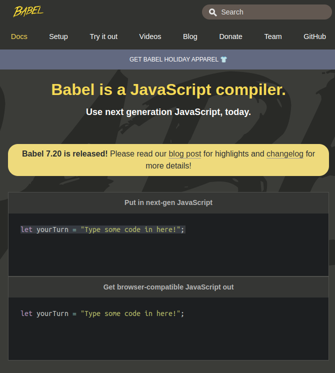

# Gutenberg Custom Block by Hand

https://www.youtube.com/watch?v=L-aWnCUUBCM

# Babel

Babel is a JavaScript compiler.

Use next generation JavaScript, today.

https://babeljs.io/repl




```js
<div id="manual-block-div">
  <label>Company Name</label>
  <input type="text" value="" placeholder="Company name here..."/>
  <label>Company Phone</label>
  <input type="text" value="" placeholder="Company phone here..." />
  <label>Company Address</label>
  <input type="text" value="" placeholder="Company address here..." />
</div>
```

Input the above and get the output.

```jsx
/*#__PURE__*/ React.createElement(
  "div",
  {
    id: "manual-block-div"
  },
  /*#__PURE__*/ React.createElement("label", null, "Company Name"),
  /*#__PURE__*/ React.createElement("input", {
    type: "text",
    value: "",
    placeholder: "Company name here..."
  }),
  /*#__PURE__*/ React.createElement("label", null, "Company Phone"),
  /*#__PURE__*/ React.createElement("input", {
    type: "text",
    value: "",
    placeholder: "Company phone here..."
  }),
  /*#__PURE__*/ React.createElement("label", null, "Company Address"),
  /*#__PURE__*/ React.createElement("input", {
    type: "text",
    value: "",
    placeholder: "Company address here..."
  })
);
```